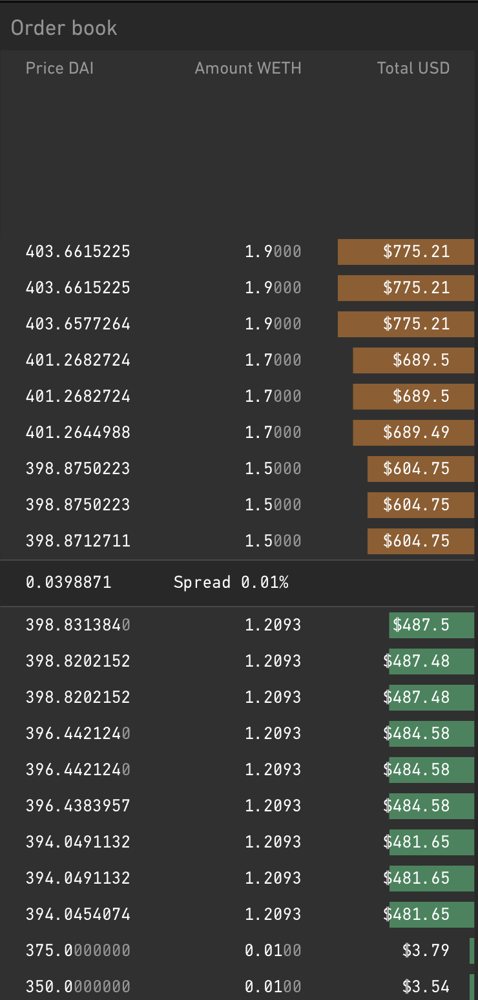
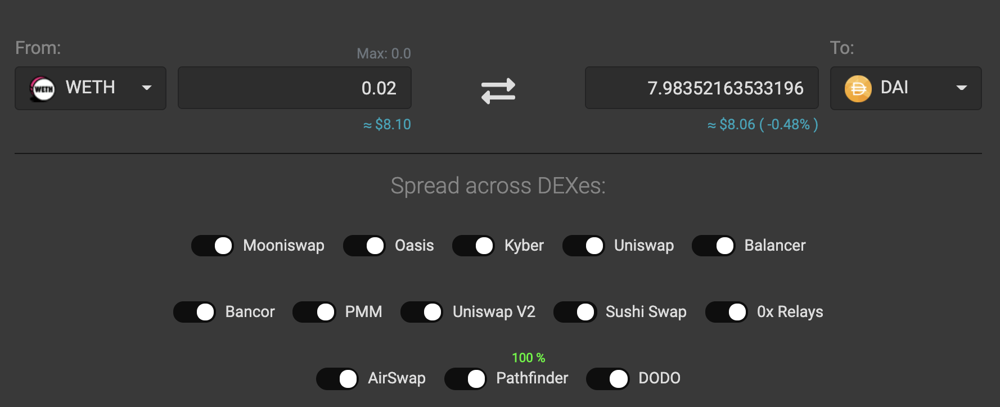
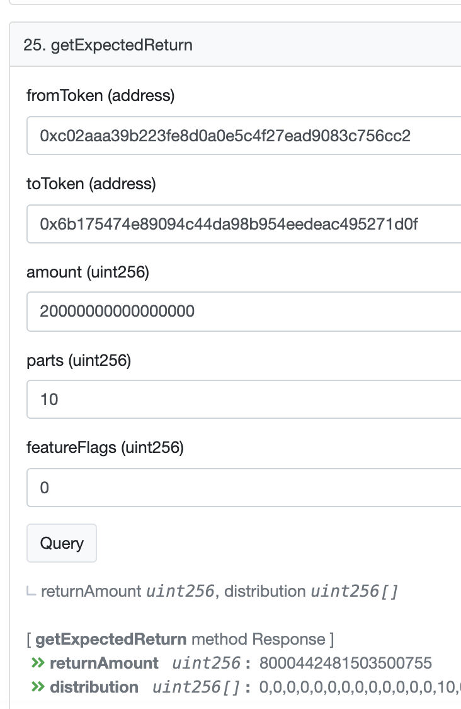

Coding a DeFi Arbitrage Bot
===

In our [previous article](https://blog.extropy.io/posts/defi1.html), we introduced Decentralized Finance as a whole, casting light upon the basic building blocks of this new ecosystem and the main strategies used to earn passive income, mainly "yield farming" and "arbitrage".

In this article we are going to guide the readers through a step by step tutorial for building an arbitrage trading bot that works with decentralized exchanges, the bot will also get flashloans in order to borrow funds to use for arbitrage. The full working code can be found on Extropy.io's [gihub repository](https://github.com/ExtropyIO/defi-bot), Extropy will publish a follow-up article that will examine the code in depth.

## What is Arbitrage

> Arbitrage is the purchase and sale of an asset in order to profit from a difference in the asset's price between marketplaces.

An example arbitrage strategy in DeFI would be to buy ETH in exchange for USDT on a decentralized such as [Kyber](https://kyber.network/) and sell it immediately afterwards on another decentralized exchange such as [Uniswap](https://uniswap.org/) at a higher price, thus making a profit in USDT, i.e. you end up with more USDT in your wallet than you had before the arbitrage. The difficulty in arbitrage lies in finding a price discrepancy (spread) for the same trading pair across two different exchanges. For an overview of the main arbitrage strategies please refer to our [previous article](https://blog.extropy.io/posts/defi1.html#h0.2_loans).

## Why Arbitrage on DeFi

Before we begin, let's explore in more detail the idea of arbitrage and why this already established practice in the centralized finance world has reached a whole new level in DeFi mainly thanks to decentralized exchanges and flashloans.

When people hear of the term arbitrage they usually associate it with trading, or rather the practice of trying to predict the markets in order to make a profit. The best thing about arbitrage as a passive income strategy, is that it **does not require any kind of prediction algorithm** or stop-loss strategy, but rather it deals with finding profitable opportunities in the present moment before they disappear or before others do.

Another advantage of doing arbitrage on DEXes (i.e. smart contracts) rather than on centralized exchanges, is that **there is no risk of losing money** should a sequence of trades not execute as expected; the transactions will be reverted due to lack of funds, because the smart contract isn't able to repay a flashloan.
On the other hand, arbitrage traders on centralized exchanges could lose money during an arbitrage due to the fact that they cannot execute multiple trades in a single transaction, i.e. unlike smart contracts, centralized exchanges' won't revert trades, thus traders will either have to sell at a loss or keep the unsold token. For example, by the time a trader receives some ETH in exchange for DAI on a centralized exchange, the USD (DAI) value of ETH on the second exchange may have dropped below the expected sell price because someone else filled the order from the orderbook first, leaving the trader with a bag of unsold ETH; this is called [price slippage](https://www.investopedia.com/terms/s/slippage.asp). 

Furthermore, developers can take advantage of flashloans in order to do arbitrage trading **using only borrowed funds**, i.e. you don't even have to own a cryptocurrency pair in order to arbitrage it.
Flasholoans are similar to the concept of leveraged trading, except they are better, because not only you are not at risk of losing all of your capital if prices are very volatile, but also because as mentioned before, the money isn't even yours; why put your capital at risk if you could **borrow millions of dollars worth of crypto with zero money down**?

To sum up, DeFi arbitrage is a huge opportunity to earn passive income at virtually no risk. Developers have unrestricted access to dozens of exchanges and hundreds of cryptocurrency pairs, with new ones popping up every day; this is an unprecedented opportunity for them given that arbitrage used to be a game that only accredited investors could play, and even then, the number of arbitrage opportunities would be close to zero because the market is already saturated and also because FIAT currency prices are much more stable than cryptocurrencies which limits currency price spreads across markets.

## Decentralized Exchanges

The main difficulty when coming up with an arbitrage strategy lies in choosing which decentralized exchanges to use and which token pairs to trade.

Before chosing which exchanges to include in the code for an arbitrage bot, readers must understand how decentralized exchanges work under the hood, as this changes the strategy radically. The most popular DEX architechtures use the concept of liquidity pools rather than orderbooks and are called Automated Market Makers. Other DEXes, in particular those using the 0x protocol use a classic orderbook and rely on makers and takers for determining an asset's price; it is easier for orderbook exchanges to fall out of sync with each other and create arbitrage opportunities.

### Automated Market Makers

Centralized exchange traders will already be familiar with using an orderbook; in conventional exchanges this is the closest thing to the concept of liquidity pools, a.k.a. [automated market makers](https://medium.com/multi-io/automated-market-makers-amm-breakdown-d3338f027230) (AMMs). AMMs only exist in decentralized finance and are a very new financial instrument.

> Automated market makers have become all the buzz, largely for replacing the traditional exchange-listing process and limit-order books with a permissionless liquidity pool run by algorithms.

Currently, the most popular AMMs are:
* Kyber Network
* Uniswap
* Balancer
* Curve Finance.

Doing an arbitrage between some of the big cryptocurrency exchanges, such as Uniswap and Kyber Network, means trying to bring prices into efficiency between two liquidity pools, i.e. behind the sceenes Kyber and Uniswap both have 'pools' where people put their funds in order to gain passive income in the form of tokens or interests. A pool is usually a smart contract that is used only for a particular cryptocurrency pair, e.g. ETH/DAI. If these two pools fell out of sync, arbitraging the price spread would mean trying to bring them in sync by buying on one and selling on the other.

> Automated market makers are smart contracts that create a liquidity pool of ERC20 tokens, which are automatically traded by an algorithm rather than an order book. This effectively replaces a traditional limit order-book with a system where assets can be automatically swapped against the pool’s latest price.


### Order Book DEXes

Some decentralized cryptocurrency exchanges have order books with limit orders, where maker and takers determine the price rather than AMMs. 
It is possible to fill the individual orders inside of an orderbook by using flashloans, if the arbitrage is profitable the flashloan will be paid back and the remainder will be profit.

[Radar Relay](http://classic.relay.radar.tech/) is one example of DEX that uses the classic order book that one would see on a centralized exchange like Coinbase.



The example above shows multiple WETH maker orders that could be filled for only a few thousand dollars worth of USDC, using a flashloan.

## Bot Strategy Overview

Before getting into the code, we will explain and test the strategy chosen for the bot using just the 0x API and the 1inch dex aggregator contract, the only tool needed for now is a browser with the Metamask extension installed.

Using orderbooks, developers can fill limit orders from a decentralized exchange and then see if the tokens aquired in the first step could be sold for more to ANY other liquidity pool. This is the strategy that will be used for the arbitrage bot in this article. In particular, the bot will query the 0x API looking for WETH/DAI pair limit orders, the bot will then query the [1inch exchange](https://1inch.exchange/#/) DEX aggregator in order to determine whether one or more of the open orders from 0x, i.e. ETH, could be sold for a higher price on any other liquidity pool.

The table below shows the currency pairs that the trading bot will look for and the exchanges that it's going to use.

|             | 0x   | 1inch |
|-------------|------|-------|
| Maker Asset | WETH | DAI   |
| Taker Asset | DAI  | WETH  |

The bot will use the 'taker' assets, i.e. it will sell DAI on 0x and sell WETH on 1inch.
Let's break down the steps from the above table:
1. Get a flashloan in DAI from DyDx exchange
2. Buy WETH from 0x usning DAI borrowed with the flashloan
3. Use 1inch to find the best exchange to sell the WETH aquired in step 2
4. Pay back the flashloan in DAI and keep the difference if any (profit)

In case the readers aren't familiar, WETH is the ERC20 tradable version of ETH.
WETH makes it easier to trade ETH from the point of view of smart contracts, it also means that users can revoke access to their WETH after sending it to an exchange, while that's not the case for ETH.


### 0x Protocol

0x is a protocol for doing wallet to wallet trading by using an off-chain API that stores the orders for the orderbook and a trading protocol enforced by smart contracts. 

Radar Relay is just an example of a DEX that is powered by the 0x protocol, i.e. it is possible to use the [0x API](https://0x.org/docs/api) in order to get limit orders for a currency pair from every exchange that uses the 0x protocol.

#### Fetching Orderbook Data

[This url](https://api.0x.org/sra/v3/orders?page=1&perPage=1000&makerAssetProxyId=0xf47261b0&takerAssetProxyId=0xf47261b0&makerAssetAddress=0xc02aaa39b223fe8d0a0e5c4f27ead9083c756cc2&takerAssetAddress=0x6b175474e89094c44da98b954eedeac495271d0f) will effectively perform a get request to the 0x API in order to retrieve all limit orders for the WETH/DAI pair. The url takes two main parameters: the maker token's contract address (WETH) and the taker token's contract address (DAI), i.e. this is the API call to use if we wanted to buy WETH using DAI. See the [0x docs](https://0x.org/docs/api#request-9) regarding orderbook requests for more information.

Let's analyze the response from the 0x API, the following object is just one order out of the many returned in the previous call.

```
"order": {
        "signature": "0x1b5ee7412dcf084cc19131e7d78ebfafa2cae8fc4b1e1f2b49dde218334bab51f06b4c1f91da6e3f3277445c5235628886bff304951fac0c9f99f613f9a42bded302",
        "senderAddress": "0x0000000000000000000000000000000000000000",
        "makerAddress": "0x0ee1f33a2eb0da738fdf035c48d62d75e996a3bd",
        "takerAddress": "0x0000000000000000000000000000000000000000",
        "makerFee": "0",
        "takerFee": "0",
        "makerAssetAmount": "20000000000000000",
        "takerAssetAmount": "7808584000000000000",
        "makerAssetData": "0xf47261b0000000000000000000000000c02aaa39b223fe8d0a0e5c4f27ead9083c756cc2",
        "takerAssetData": "0xf47261b00000000000000000000000006b175474e89094c44da98b954eedeac495271d0f",
        "salt": "95222041148024943540833237129371349480418435215051967676171665233326083547721",
        "exchangeAddress": "0x61935cbdd02287b511119ddb11aeb42f1593b7ef",
        "feeRecipientAddress": "0x86003b044f70dac0abc80ac8957305b6370893ed",
        "expirationTimeSeconds": "1604395325",
        "makerFeeAssetData": "0x",
        "chainId": 1,
        "takerFeeAssetData": "0x"
      },
```

The important bits from the order above are maker and taker amounts:
```
"makerAssetAmount": "20000000000000000",
"takerAssetAmount": "7808584000000000000",
```

The maker amount is the amount of WETH for sale on that particular order followed by 18 decimal places, while the taker amount is in DAI, also followed by 18 decimal places.

In order to find out the DAI price of 1 ETH, we divide taker amout by maker amount, using the command line to avoid counting zeroes:

```
echo 7808584000000000000/20000000000000000 | bc
```

The result is 390 (DAI for 1 WETH). Next, we check whether we could sell the WETH on a liquidity pool for more than 390 USD.

### 1inch DEX Aggregator

> 1inch offers the best rates by discovering the most efficient swapping routes across all leading DEXes.



It may be useful for the reader to know that another popular DEX aggregator exists called [DEX.AG](https://dex.ag/). 1inch is essentially a smart contract that can be queried in various ways, the easiest way to do so is via the UI as shown in the picture above, however the same exact thing can be achieved by queryng the smart contract directly [on Etherscan](https://etherscan.io/address/0xc586bef4a0992c495cf22e1aeee4e446cecdee0e#readContract).



The above function was filled in with the WETH and DAI contract addresses and the taker asset amount, i.e. 0.2 WETH as shown in the example order from 0x. The idea is that if this amount is greater than the one returned by 0x, then there is a profitable arbitrage opportunity. We can use the command line again to determine profitability.

```
echo 8000442481503500755/20000000000000000 | bc
```
which results in 400. Therefore, we could buy 1 WETH for 390 DAI on 0x and sell 1 WETH for 400 on 1inch, making a 10 DAI profit (minus fees). However, a few minutes have gone by while writing this article between the 0x API query and the 1inch contract query which means that this opportunity may not actually exist in practice, because we would need both limit orders to exist at the same time for the arbitrage to work.


## Coding the bot

In the follow-up article, we will go through the code step by step, which is essentially a node.js bot with all the arbitrage logic in it and a smart contract that will get called by the bot in order to request flashloans from DyDx.
The code is already available on Extropy's [gihub repository]() for thoose readers who want to get a first hand look, before the follow-up article gets published next week.
